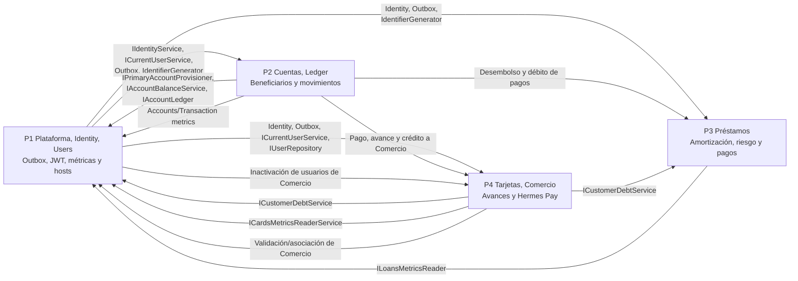

# Artemis Banking Pro (ABP)

## Plan técnico de distribución de trabajo para 4 programadores

**Documento fuente:** `ABP_Document.md`, versión funcional 1.0, 30 de junio de 2026  
**Stack objetivo:** .NET 9, ASP.NET Core MVC, ASP.NET Core Web API, EF Core Code First, ASP.NET Identity, JWT, CQRS + MediatR, FluentValidation, AutoMapper, xUnit, Serilog, Swagger y Azure Functions  
**Arquitectura:** Onion Architecture  
**Equipo:** exactamente 4 programadores

---

## Tecnologías y estándares obligatorios

Esta sección centraliza el stack acordado para que todos los programadores y
agentes mantengan las mismas decisiones técnicas. `ABP_Document.md` contiene
los requisitos académicos originales; este plan define cómo aplicarlos en la
solución.

| Área | Tecnología o estándar | Uso acordado en ABP | Estado/nota |
|---|---|---|---|
| Plataforma | .NET 9 | Target framework de todos los proyectos .NET. | Base actual |
| Web | ASP.NET Core MVC | WebApp, Controllers, ViewModels y Views. | Base actual |
| API | ASP.NET Core Web API + Swagger/OpenAPI | Endpoints HTTP, contratos y documentación interactiva. | OpenAPI ya referenciado; mantener Swagger actualizado |
| Arquitectura | Onion Architecture | Dependencias hacia el centro: Domain no depende de capas externas. | Obligatorio |
| Persistencia | Entity Framework Core + SQL Server | Code First, DbContext, configuraciones, repositorios y migraciones. | EF Core 9; obligatorio |
| Identidad | ASP.NET Identity | Usuarios, roles, contraseñas, activación y recuperación. | Cookies en WebApp; JWT en Web API |
| Autenticación API | JWT Bearer | Autenticación/autorización de la Web API y sus endpoints. | Obligatorio |
| Casos de uso | CQRS + MediatR | Commands/Queries, handlers y `ISender`; los Controllers deben ser delgados. | Obligatorio; no sustituir por lógica en Controllers |
| Validación de aplicación | FluentValidation + MediatR Behaviors | Validar Commands/Queries antes de ejecutar sus handlers. | Obligatorio |
| Validación MVC | Validaciones del framework en ViewModels | Validar los datos de formularios de la WebApp en la capa de presentación. | Obligatorio según `ABP_Document.md` |
| Mapeo | AutoMapper | Mapear ViewModels, Entities y DTOs mediante Profiles. | Obligatorio |
| UI/CSS | Tailwind CSS 4 | Estilos de la WebApp y generación de `wwwroot/css/output.css`. | Estándar actual del repositorio; el documento permite Bootstrap u otro framework CSS |
| Logging | Serilog | Auditoría, diagnóstico, errores, correlation id y seguimiento de operaciones. | Obligatorio; nunca registrar secretos o CVC |
| Pruebas | xUnit | Pruebas unitarias de Domain/Application y pruebas de integración. | Obligatorio |
| Procesos programados | Azure Functions | Proceso de mora de préstamos (`LoanDelinquency`). | Obligatorio; pendiente de completar en `ABP.Functions` |
| Email | SMTP + MimeKit | Activación, recuperación de contraseña y notificaciones. | MimeKit ya usado en Identity |

### Regla para dependencias pendientes

La tabla expresa el stack obligatorio, aunque una tecnología todavía no tenga
su `PackageReference` o implementación completa en cada proyecto. Si una tarea
necesita MediatR, FluentValidation, AutoMapper, Serilog o Azure Functions, debe
completar la integración prevista y no reemplazarla silenciosamente por otra
opción. Antes de agregar una tecnología nueva, actualizar esta sección y
acordar el cambio con el equipo.

### Reglas rápidas de implementación

- La API despacha Commands/Queries con MediatR; los Behaviors ejecutan FluentValidation.
- La WebApp usa servicios tradicionales de Application y ViewModels; esos servicios no despachan Commands/Queries ni implementan CQRS internamente.
- AutoMapper se configura mediante Profiles y debe tener una prueba de configuración.
- Domain no referencia ASP.NET Identity, EF Core, JWT, SMTP, Serilog ni detalles de infraestructura.
- Las respuestas de error usan manejo global y Problem Details; Swagger debe reflejar los contratos vigentes.

---

## 1. Resumen ejecutivo

La distribución recomendada es por **verticales de negocio**, no por “frontend”, “backend” o capas aisladas. Cada programador será responsable de las reglas de su dominio en Domain/Application/Infrastructure y de las superficies MVC/API que las consumen. Por requisito académico, cada caso de uso puede tener una implementación de servicio para MVC y otra implementación CQRS para API; ambas siguen bajo el mismo dueño vertical.

| Programador | Rol técnico | Vertical principal | Carga relativa inicial |
|---|---|---|---:|
| **P1** | Platform & Identity Lead | Plataforma, seguridad, usuarios, notificaciones, observabilidad y composición de pantallas globales | 52 pts |
| **P2** | Accounts & Money Movement Lead | Cuentas de ahorro, ledger, beneficiarios, transferencias, depósitos y retiros | 54 pts |
| **P3** | Lending Lead | Préstamos, riesgo, amortización, pagos, mora y Azure Function | 53 pts |
| **P4** | Cards, Commerce & Payments Lead | Tarjetas, pagos de tarjeta, avances, comercios y Hermes Pay | 54 pts |

Los puntos solo sirven para comparar la carga entre verticales. El equipo debe reestimar el backlog después del Sprint 0.

### Regla de propiedad

- El dueño de una vertical implementa sus reglas en todas las capas.
- MVC y API mantienen implementaciones de Application separadas, aunque exista duplicación de orquestación por el requisito académico.
- Los Controllers son adaptadores delgados.
- La Web App consume servicios de Application, según exige el documento.
- La API consume Commands/Queries de MediatR con FluentValidation.
- Servicios MVC y handlers CQRS pueden compartir DTOs e invariantes de Domain, pero ninguno delega su ejecución al otro.
- P1 custodia los archivos de composición global, la configuración de los hosts y las migraciones; esto no convierte a P1 en dueño de todas las entidades.

---

## 2. Estructura de solución acordada

```text
ArtemisBankingPro.slnx
  ABP.Domain/
    Common/
    Entities/
      Accounts/
      Lending/
      CreditCards/
      Commerce/
    Enums/
    Interfaces/
    ValueObjects/
  ABP.Application/
    Behaviors/
    Common/
      DTOs/
      Services/
      Interfaces/
        Identity/
        Services/
    Features/
      Auth/
        Commands/
        Queries/
        Services/
          Interfaces/
          Implementations/
        DTOs/
        Validation/
      Users/
        Commands/
        Queries/
        Services/
          Interfaces/
          Implementations/
        DTOs/
        Validation/
      Accounts/
        Commands/
        Queries/
        Services/
          Interfaces/
          Implementations/
        DTOs/
        Validation/
      Loans/
        Commands/
        Queries/
        Services/
          Interfaces/
          Implementations/
        DTOs/
        Validation/
      CreditCards/
        Commands/
        Queries/
        Services/
          Interfaces/
          Implementations/
        DTOs/
        Validation/
      Commerce/
        Commands/
        Queries/
        Services/
          Interfaces/
          Implementations/
        DTOs/
        Validation/
      HermesPay/
        Commands/
        Queries/
        Services/
          Interfaces/
          Implementations/
        DTOs/
        Validation/
      Dashboards/
        Queries/
        Services/
          Interfaces/
          Implementations/
        DTOs/
        Validation/
    Mappings/
    Settings/
  ABP.Infrastructure/
    ABP.Infrastructure.Identity/
      Authentication/
      Email/
      Identity/
      Security/
    ABP.Infrastructure.Persistence/
      Configurations/
      Persistence/
      Repositories/
  ABP.WebApp/
    Areas/
      Admin/
      Client/
      Cashier/
    Controllers/
    ViewModels/
    Views/
  ABP.WebApi/
    Controllers/
    Middleware/
  ABP.Functions/
    LoanDelinquency/
  tests/
    ABP.Domain.UnitTests/
    ABP.Application.UnitTests/
    ABP.Infrastructure.IntegrationTests/
    ABP.WebApi.IntegrationTests/
    ABP.WebApp.IntegrationTests/
```

### Criterio de organización por Feature y reutilización de validaciones

Esta estructura organiza las funcionalidades del negocio por **Feature vertical** dentro de `ABP.Application/Features/`, encapsulando los artefactos de CQRS, servicios tradicionales, DTOs y validadores en un solo lugar.

#### Clasificación y responsabilidad de carpetas de servicios
- **`Features/{Feature}/Services/Interfaces/`**: Contratos de servicios de negocio pertenecientes a una vertical específica (ej: `ICreditCardService.cs`).
- **`Features/{Feature}/Services/Implementations/`**: Implementaciones concretas de servicios de negocio pertenecientes a la vertical (ej: `CreditCardService.cs`).
- **`ABP.Application/Common/Interfaces/Services/`**: Puertos técnicos transversales del sistema (ej: `IClock`, `IEmailService`, `IFileManager`, `ICurrentUserService`).
- **`ABP.Application/Common/Interfaces/Identity/`**: Puertos de abstracción para servicios de identidad e infraestructura (ej: `IAccountTokenService`).
- **`ABP.Application/Common/Services/`**: Servicios y contratos genéricos reutilizables (ej: `IGenericService<,,>`, `GenericService<,,>`).

#### Responsabilidad de las carpetas dentro de cada Feature (`Features/{FeatureName}/`)
- **`Commands/`**: Contiene los comandos, handlers y validators específicos de CQRS.
- **`Queries/`**: Contiene las consultas, handlers y validators específicos de CQRS.
- **`Services/`**: Contiene las subcarpetas `Interfaces/` e `Implementations/` para los servicios tradicionales de la vertical (consumidos por MVC).
- **`DTOs/`**: Contiene únicamente los objetos de transferencia de datos de la feature.
- **`Validation/`**: Nombre único estandarizado para los validators de los DTOs y reglas reutilizables de FluentValidation. (La carpeta `Validators/` no debe usarse para evitar ambigüedades).

#### Problema que resuelve y decisión arquitectónica
Como el proyecto implementa los mismos casos de uso mediante CQRS (para API) y mediante servicios tradicionales (para MVC) como **requisito académico**, existe el riesgo de duplicar reglas de validación.

Para evitar esto, se toma la decisión arquitectónica de **duplicar la implementación de los flujos por exigencia académica, pero no duplicar contratos ni reglas de validación**.

#### Funcionamiento en CQRS (Web API)
```text
Controller -> MediatR -> ValidationBehavior -> CommandValidator (ej: CreateCreditCardCommandValidator) -> DTOValidator (ej: CreateCreditCardRequestValidator) -> CommandHandler
```
El `ValidationBehavior` interceptará automáticamente todos los Commands/Queries enviados mediante MediatR. Los `CommandValidators` reutilizarán las reglas comunes definidas en los `DTOValidators` ubicados en `Validation/` mediante `SetValidator`. De esta forma, los handlers no necesitarán validar manualmente.

#### Funcionamiento en Servicios Tradicionales (Web App MVC)
```text
Controller -> TraditionalService (ej: CreditCardService) -> DTOValidator (ej: CreateCreditCardRequestValidator) -> Lógica del servicio
```
Los servicios tradicionales no pasan por MediatR ni sus behaviors. Por ello, el servicio inyectará y ejecutará explícitamente el mismo `DTOValidator` compartido (ej: `await _validator.ValidateAndThrowAsync(dto, cancellationToken);`).

#### Ejemplo conceptual de estructura por Feature:
```text
Features/
└── CreditCards/
    ├── Commands/
    │   └── CreateCreditCard/
    │       ├── CreateCreditCardCommand.cs
    │       └── CreateCreditCardCommandValidator.cs
    │
    ├── Queries/
    │
    ├── Services/
    │   ├── Interfaces/
    │   │   └── ICreditCardService.cs
    │   └── Implementations/
    │       └── CreditCardService.cs
    │
    ├── DTOs/
    │   └── CreateCreditCardRequest.cs
    │
    └── Validation/
        └── CreateCreditCardRequestValidator.cs
```

#### Estado de implementación e hitos pendientes `[PENDIENTE - Arquitectura Objetivo]`
El alcance de reorganización actual completó la migración física de archivos existentes, la normalización de namespaces y el establecimiento de la estructura de carpetas por feature. Quedan explícitamente **pendientes** como trabajo futuro del equipo para el desarrollo de los casos de uso:
1. Implementar `ValidationBehavior<TRequest, TResponse>` en `Behaviors/`.
2. Registrar MediatR y el `ValidationBehavior` mediante `AddApplicationCqrs()`.
3. Crear los validadores DTO con FluentValidation en `Features/{Feature}/Validation/`.
4. Crear command validators que reutilicen los DTO validators mediante `SetValidator`.
5. Registrar `AddApplicationServices` en la composición DI de `ABP.WebApp`.
6. Inyectar `IValidator<TDto>` y ejecutar `ValidateAndThrowAsync` en los futuros servicios tradicionales MVC.

#### Regla principal de validación
1. El validator del DTO (`CreateCreditCardRequestValidator`) vive en `Validation/` y contiene las reglas compartidas del caso de uso.
2. El validator del Command (`CreateCreditCardCommandValidator`) vive en `Commands/` y valida aspectos específicos del request CQRS, reutilizando el validator del DTO mediante `SetValidator`.
3. El servicio tradicional (`CreditCardService`) vive en `Services/Implementations/` e inyecta y reutiliza directamente ese mismo validator del DTO.

#### Beneficios del enfoque
- Evita duplicación de reglas de validación.
- Mantiene los DTOs separados de sus validadores.
- Mantiene clara la diferencia entre CQRS y servicios tradicionales.
- Centraliza la validación transversal de CQRS mediante behaviors.
- Facilita pruebas unitarias e integración.
- Organiza el proyecto por feature y no por tipo técnico global.
- Cumple con el requisito académico sin comprometer la mantenibilidad del código.

### Uso combinado de servicios y CQRS

Esta mezcla responde directamente a los dos requisitos académicos del documento. Se acepta la duplicación de orquestación entre ambos caminos para demostrar por separado servicios tradicionales y CQRS:

```text
WebApp Controller -> servicio de Application -> Domain + repositories
Web API Controller -> ISender (MediatR) -> Command/Query Handler -> Domain + repositories
```

- La **Web API** implementa CQRS: cada endpoint envía un Command o Query mediante MediatR y los Behaviors ejecutan FluentValidation.
- La **Web App MVC** usa servicios tradicionales de Application, como exige el documento, y no despacha Commands/Queries mediante MediatR.
- Servicios y handlers son implementaciones paralelas e independientes: pueden compartir DTOs e invocar las mismas invariantes de Domain, pero no comparten un ejecutor de Application ni se llaman entre sí.
- La duplicación de orquestación de Application se cubre con pruebas separadas de servicios y handlers para asegurar resultados equivalentes en MVC y API.
- Los **repositorios y servicios genéricos** se reservan para CRUD sencillo. Flujos financieros —pagos, transferencias, préstamos, avances y Hermes Pay— cuentan con un servicio especializado para MVC y un handler especializado para API.

### Dependencias permitidas

```text
Domain            -> ninguna capa interna
Application       -> Domain
Infrastructure    -> Application + Domain
WebApp            -> Application; Infrastructure solo durante composición/DI
WebApi            -> Application; Infrastructure solo durante composición/DI
Functions         -> Application; Infrastructure solo durante composición/DI
Tests             -> proyecto bajo prueba
```

ASP.NET Identity, EF Core, JWT, SMTP y Serilog no deben filtrarse hacia Domain.

---

## 3. Sprint 0 / Día 0: contratos compartidos

Duración sugerida: **2 a 3 días laborales**. La salida del Sprint 0 es una rama base compilable, contratos congelados para el primer incremento y dobles de prueba para todos los puertos aún no implementados.

### 3.1 Proyectos, convenciones y baseline

P1 prepara el esqueleto; los cuatro programadores revisan y aprueban:

- Solución y referencias de proyectos conforme al diagrama Onion.
- .NET 9 fijado en `global.json`.
- `Directory.Build.props` con nullable habilitado, warnings acordados y análisis estático.
- Convención de namespaces por vertical.
- Registro de dependencias mediante métodos `AddApplication()` y `AddInfrastructure()`.
- `appsettings` sin secretos y User Secrets/variables de entorno para valores sensibles.
- Test projects y fixtures base.
- Swagger con autenticación Bearer.
- Serilog, identificador de correlación y enriquecimiento de usuario/rol.
- `ProblemDetails` y Global Exception Handler.
- CI mínima: restore, build, unit tests e integration tests.

### 3.2 Entidades y agregados que deben acordarse primero

| Agregado/entidad | Campos o decisiones mínimas que se congelan | Propietario |
|---|---|---|
| `ApplicationUser` | Identity id, username, email, first/last name, identification, active flag, createdAt, optional commerceId | P1 |
| `AccountToken` | userId, purpose, tokenHash, createdAt, expiresAt, usedAt | P1 |
| `SavingsAccount` | ownerUserId, 9-digit accountNumber, balance, type, status, createdAt, rowVersion | P2 |
| `AccountTransaction` | accountId, operationId, amount, direction, operationType, origin, beneficiary, status, rejectionReason, actorUserId, actorRole, createdAt | P2 |
| `Beneficiary` | ownerUserId, beneficiaryAccountId, createdAt, unique owner/account constraint | P2 |
| `Loan` | clientId, 9-digit loanNumber, capital, pendingAmount, annualRate, term, status, assignedBy, createdAt, rowVersion | P3 |
| `LoanInstallment` | loanId, number, dueDate, installment, interest, capital, pendingAmount, paymentStatus, isLate | P3 |
| `LoanPayment` | loanId, sourceAccountId, effectiveAmount, actor, date, operationId | P3 |
| `CreditCard` | clientId, 16-digit cardNumber, cvcHash, limit, debt, expiration, status, assignedBy, createdAt, rowVersion | P4 |
| `CardConsumption` | cardId, commerceId opcional, commerceName/AVANCE, amount, status, date, operationId | P4 |
| `CardPayment` | cardId, sourceAccountId, effectiveAmount, actor, date, operationId | P4 |
| `Commerce` | name, description, email, phone, RNC, status, createdBy, createdAt, rowVersion | P4 |
| `OutboxMessage` | type, payload, createdAt, processedAt, retryCount, lastError | P1 |
| `FinancialIdentifier` | value de 9 dígitos, type Cuenta/Préstamo, unique index global | P1, usado por P2/P3 |

### 3.3 Enumeraciones compartidas

Se congelan valores internos en inglés o español, pero nunca se persisten textos visuales arbitrarios:

- `SystemRole`: Administrator, Cashier, Client, Commerce.
- `SavingsAccountType`: Primary, Secondary.
- `SavingsAccountStatus`: Active, Cancelled.
- `LoanStatus`: Active, Completed.
- `InstallmentPaymentStatus`: Pending, PartiallyPaid, Paid.
- `CreditCardStatus`: Active, Cancelled.
- `CommerceStatus`: Active, Inactive.
- `TransactionDirection`: Debit, Credit.
- `FinancialOperationType`: InitialBalance, AdministrativeCredit, LoanDisbursement, Deposit, Withdrawal, ExpressTransfer, BeneficiaryTransfer, OwnAccountTransfer, ThirdPartyTransfer, CreditCardPayment, LoanPayment, CashAdvance, HermesPayment, AccountCancellationTransfer.
- `TransactionStatus`: Approved, Rejected.
- `ConsumptionStatus`: Approved, Rejected.
- `AccountTokenPurpose`: Activation, PasswordReset.

Los textos “ACTIVA”, “APROBADA”, “DÉBITO”, etc. se resuelven en Presentation/DTO mapping.

### 3.4 Tipos base y DTOs que se congelan

Los DTOs consumidos tanto por los servicios tradicionales como por los casos CQRS se ubican dentro de cada módulo en `ABP.Application/Features/{Feature}/DTOs`. No pertenecen exclusivamente a ninguna superficie de presentación.

#### Comunes

- `PagedRequest(Page, PageSize)`.
- `PagedResult<T>(Page, PageSize, TotalRecords, TotalPages, Data)`.
- `CurrentUserContext(UserId, UserName, Role, CommerceId?)`.
- `OperationResult<T>` para resultados de servicios; los errores de la API se reportan con `ApiException` (status HTTP + mensaje), fieles a `ABP_Document`.
- `Money` o política central de decimal: persistencia `decimal(18,2)`; cálculos de amortización con mayor precisión antes del redondeo final.
- `ProblemDetails` (RFC 7807) con `traceId` y errores de validación; sin `errorCode` como mecanismo de control (fidelidad a `ABP_Document`).
- `FinancialOperationReceipt` con `OperationId`, monto efectivo y fecha.

#### Identity y usuarios

- `LoginRequest`, `JwtResponse`.
- `ConfirmAccountRequest`.
- `GetResetTokenRequest`.
- `ResetPasswordRequest`.
- `UserSummaryDto`, `UserDetailDto`.
- `CreateUserRequest`, `CreateCommerceUserRequest`, `UpdateUserRequest`, `ChangeUserStatusRequest`.
- `CreateUserViewModel`, `EditUserViewModel`, `LoginViewModel`, `ForgotPasswordViewModel`, `ResetPasswordViewModel`.

#### Cuentas y movimientos

- `SavingsAccountSummaryDto`, `SavingsAccountDetailDto`, `AccountTransactionDto`.
- `CreateSecondaryAccountRequest`, `CancelSavingsAccountRequest`.
- `TransferFundsRequest`, `DepositRequest`, `WithdrawalRequest`.
- `BeneficiaryDto`, `AddBeneficiaryRequest`.
- ViewModels de selección, confirmación y recibo para cada operación MVC.

#### Préstamos

- `LoanSummaryDto`, `LoanDetailDto`, `LoanInstallmentDto`.
- `CreateLoanRequest`, `HighRiskAssessmentDto`, `UpdateLoanRateRequest`.
- `LoanPaymentRequest`, `LoanPaymentResult`.
- ViewModels de selección de cliente, asignación, advertencia de riesgo, detalle, cambio de tasa y pago.

#### Tarjetas, comercio y Hermes Pay

- `CreditCardSummaryDto`, `CreditCardDetailDto`, `CardConsumptionDto`.
- `CreateCreditCardRequest`, `UpdateCreditLimitRequest`, `CancelCreditCardRequest`.
- `CreditCardPaymentRequest`, `CashAdvanceRequest`.
- `CommerceSummaryDto`, `CommerceDetailDto`, `CreateCommerceRequest`, `UpdateCommerceRequest`, `ChangeCommerceStatusRequest`.
- `ProcessHermesPaymentRequest`, `HermesTransactionDto`.
- ViewModels de asignación, detalle, límite, cancelación, pago y avance.

Los DTOs de tarjeta nunca exponen el número completo, CVC ni hash. La única excepción es el request entrante de Hermes Pay, que contiene los datos suministrados por el consumidor y debe redactarse en logs.

### 3.5 Interfaces que desbloquean el trabajo paralelo

#### Persistencia y plataforma

```csharp
IGenericRepository<TEntity, TKey>
IGenericService<TEntity, TKey>
IUnitOfWork
ITransactionalExecutor
IClock
ICurrentUserService
IFinancialIdentifierGenerator
IEmailSender
INotificationOutbox
IIdempotencyStore
```

El repositorio/servicio genérico cubre CRUD simple. Operaciones financieras usan repositorios especializados y servicios de dominio; nunca se implementan como una secuencia de llamadas CRUD desde un Controller.

#### Identity y usuarios

```csharp
IIdentityService
IJwtTokenService
IAccountTokenService
IUserDirectory
IUserManagementService
IUserRepository
```

`IUserRepository` concentra las consultas de persistencia que necesita la
selección administrativa de clientes: página uniforme de Clientes activos,
búsqueda por cédula, consulta por Id para revalidar que siga activo y conteo de
Clientes activos para el promedio.
No calcula productos, deudas ni promedios; esas son reglas transversales de
Application.

#### Cuentas y ledger

```csharp
ISavingsAccountRepository
IAccountTransactionRepository
IPrimaryAccountProvisioner
IAccountLedger
IMoneyTransferService
IAccountBalanceService
IBeneficiaryService
IAccountsMetricsReader
```

#### Préstamos

```csharp
ILoanRepository
IAmortizationCalculator
ILoanOriginationService
ILoanPaymentService
ILoanRateService
ILoanDelinquencyService
ILoansMetricsReader
```

#### Tarjetas y comercios

```csharp
ICreditCardRepository
ICvcService
ICardPaymentService
ICashAdvanceService
ICardsMetricsReaderService
ICommerceRepository
ICommerceAuthorizationResolverService
IHermesPaymentService
```

#### Consultas y servicios transversales

```csharp
ICustomerDebtService
IAdminDashboardQuery
ICashierDashboardQuery
IClientPortfolioQuery
IPaymentsMetricsReader
ITransactionsMetricsReader
```

`ICustomerDebtService` compone la deuda total individual y el promedio de
deuda de los Clientes activos. Usa `IUserRepository` para determinar los
Clientes activos, `ILoanRepository.GetActiveDebtByClientIdAsync(...)` e
`ICreditCardRepository.GetActiveDebtByClientIdAsync(...)` para el caso
individual, y sus operaciones `GetTotalActiveDebtForActiveClientsAsync(...)`
para el promedio. No crea adapters denominados *Reader* ni lleva cálculos de
productos financieros a `IUserRepository`.

Para listados paginados, los repositorios de préstamos y tarjetas exponen una
consulta de deuda activa por lote de ClientIds; `ICustomerDebtService` combina
ambos diccionarios sin ejecutar consultas EF concurrentes sobre el mismo
`DbContext` y sin incurrir en N+1 consultas.

Esta decisión no modifica los `Queries` ni los `QueryHandlers` de CQRS: estos
siguen siendo casos de uso de Web API. Las consultas de clientes activos son
operaciones de persistencia del repositorio, y la composición de deuda es un
servicio de Application.

Estas interfaces se ubican en Application. Cada consumidor puede usar mocks hasta que el proveedor real esté integrado.

### 3.6 Decisiones técnicas obligatorias del Sprint 0

1. **Persistencia:** SQL Server mediante EF Core Code First.
2. **Dinero:** `decimal`, nunca `double`; persistencia monetaria a dos decimales. No se introduce una política de redondeo de negocio adicional en Sprint 0; los cálculos de amortización se cubrirán con pruebas de aceptación antes de implementarse.
3. **Fechas:** persistir UTC y calcular “hoy” con zona bancaria configurable `America/La_Paz`.
4. **Vencimientos:** definir qué ocurre si el préstamo nace el día 29, 30 o 31 y el mes destino no contiene ese día; propuesta: último día válido del mes.
5. **Atomicidad:** débito, crédito, deuda, cuota y registros de ledger se confirman en una sola transacción de base de datos.
6. **Concurrencia:** `rowversion`/optimistic concurrency en cuentas, préstamos, tarjetas y comercios; revalidar saldo/deuda dentro de la transacción.
7. **Notificaciones:** Gmail SMTP con App Password almacenado en .NET User Secrets; el envío se implementará mediante Outbox para que un fallo de correo nunca revierta la operación financiera.
8. **Identificadores de 9 dígitos:** registro central con índice único para impedir colisiones entre cuentas y préstamos.
9. **CVC:** `ICvcService` centraliza la generación, el hash y la verificación del CVC mediante `Generate`, `Hash` y `Verify`. Debe usar HMAC-SHA-256 con secreto externo o un mecanismo equivalente seguro, sin retornar ni registrar el CVC ni su hash. El nombre sustituye al contrato preliminar `ICvcHasherService`, ya que la responsabilidad acordada también incluye generar y verificar el CVC.
10. **Tokens:** su implementación y persistencia se abordarán en el Sprint de Identity; deben cumplir activación de un solo uso y reset con vigencia máxima de 30 minutos.
11. **Idempotencia:** POST financieros y confirmaciones MVC reciben un `OperationId`/`Idempotency-Key` para impedir doble cargo por reintentos o doble clic.
12. **Transacciones rechazadas:** registrar intento solo cuando existe un producto origen identificable, sin cambiar balances/deudas.
13. **Seguridad por superficie:** Web App permite Administrador/Cajero/Cliente; API permite Administrador/Comercio; Comercio nunca inicia sesión en MVC.
14. **Migraciones:** cada programador entrega configuraciones EF de su vertical; solo P1 genera/integra la migración consolidada.
15. **Identificadores de Entidad y Comercio:** `CommerceId` (y todos los demás identificadores de entidades del dominio) utilizan `Guid`. La única excepción es `User.Id`, que es `string` por integración con ASP.NET Core Identity.
16. **Destino de Avance de Efectivo:** El avance de efectivo acredita una cuenta de ahorro activa seleccionada por el cliente (no únicamente la cuenta principal).
17. **Fakes Obligatorios de Sprint 0:** Los fakes exportados en Sprint 0 son los puertos interverticales requeridos para trabajo en paralelo (por ejemplo, `FakeCustomerDebtService` para P3 e `FakeCommerceAuthorizationResolverService` para P1).
18. **Expiración de Tarjetas:** `CreditCard.ExpirationDate` representa el último día calendario del mes indicado por el formato MM/AA y la tarjeta permanece válida durante todo ese día según la fecha bancaria/UTC.

---

## 4. Asignación detallada

## Programador 1 — Platform, Identity & User Management Lead

### Misión

Construir la plataforma compartida y los flujos de identidad para que los demás verticales puedan ejecutarse con seguridad, trazabilidad, notificaciones y contratos estables. Después de la fundación, integra las pantallas globales y lecturas agregadas.

### Capas bajo su responsabilidad

| Capa | Responsabilidad |
|---|---|
| Domain | Roles, políticas de activación, `AccountToken`, errores/códigos comunes y eventos de notificación |
| Application | Servicios de autenticación/usuarios, queries de dashboards y portafolio, contratos comunes |
| Infrastructure | Identity, cookies, JWT, token store, email/outbox, Serilog, Clock, identifier registry, DbContext bootstrap, seeding y migraciones |
| Presentation | Login/activación/reset/logout, Access Denied, layouts por rol, Admin Users, Home Admin y composición de Home Cliente |

### Web App: módulos, Controllers y vistas

**`AccountController`**

- GET/POST Login.
- Redirección por rol si ya está autenticado.
- GET Activate/ConfirmAccount.
- GET/POST ForgotPassword.
- GET/POST ResetPassword.
- POST Logout.
- GET AccessDenied.
- Bloqueo explícito del rol Comercio en MVC.

**Área Admin — `UsersController`**

- Index paginado, máximo 20, orden descendente y filtro por rol.
- Create, incluyendo monto inicial condicional.
- Edit, contraseña opcional y monto adicional para Cliente.
- ConfirmStatus/ChangeStatus.
- Bloqueo de autoedición y autocambio de estado.

**Área Admin — `HomeController`**

- Indicadores históricos/del día.
- Clientes activos/inactivos.
- Total de productos.
- Préstamos, tarjetas y cuentas activas.
- Deuda promedio.
- Consume interfaces métricas de P2/P3/P4; se desarrolla primero con mocks.

**Área Client — `HomeController`**

- Composición del portafolio activo.
- Sección de cuentas siempre que existan.
- Secciones condicionales de préstamos y tarjetas.
- Mensaje sin productos.
- Delega páginas de detalle a los Controllers de P2/P3/P4.

**Elementos compartidos de UI**

- `_Layout`, menús por rol, mensajes flash, Problem Details visual.
- Protección por `[Authorize(Roles = ...)]`.
- Redirección al Home correcto desde Access Denied.

### Web API: Controllers y endpoints

**`AccountController`**

- `POST /account/login`
- `POST /account/confirm`
- `POST /account/get-reset-token`
- `POST /account/reset-password`

**`UsersController`**

- `GET /api/users`
- `GET /api/users/commerce`
- `POST /api/users`
- `POST /api/users/commerce/{commerceId}`
- `PUT /api/users/{id}`
- `PATCH /api/users/{id}/status`
- `GET /api/users/{id}`

> **Excepción CQRS (requisito académico):** el API de gestión de usuarios y seguridad
> (P1: `AccountController` y `UsersController`) NO usa Commands/Queries MediatR.
> Se implementa con Controllers delgados que despachan hacia `IBaseAccountService`
> (servicios tradicionales de Application), usando los DTOs compartidos de
> `ABP.Application/Common/DTOs/Users` como modelos de request/response y
> FluentValidation ejecutada dentro del servicio. Los módulos P2-P4 conservan CQRS + MediatR.

Todos los demás casos de API (P2-P4) se implementan como Commands/Queries con MediatR y validators FluentValidation.

### Integraciones que debe coordinar

- Para crear Cliente o Comercio llama a `IPrimaryAccountProvisioner` de P2.
- Para validar comercio y asociación 1:1 llama a un reader de P4.
- Para Home Admin consume métricas de P2/P3/P4 y `ICustomerDebtService` para el promedio de deuda.
- Para Home Cliente consume `IClientPortfolioQuery` con adaptadores de P2/P3/P4.
- Publica notificaciones en Outbox; no llama SMTP dentro de una transacción financiera.

### Pruebas xUnit asignadas

**Unitarias**

- Login válido por cada rol MVC.
- Rechazo de credenciales inválidas, usuario inactivo y Comercio en MVC.
- Login API válido para Administrador/Comercio y rechazo Cliente/Cajero.
- Token JWT con userId, username, rol, issued-at y expiration.
- Token de activación de un solo uso.
- Reset expirado a los 30 minutos, token usado, token ajeno y passwords diferentes.
- Crear usuario con unicidad de username/email/cédula.
- Crear Cliente solicita cuenta principal y crédito inicial cuando aplica.
- Editar sin password conserva el hash actual.
- Monto adicional cero no crea movimiento; positivo solicita crédito administrativo.
- Bloqueo de autoedición/autoinactivación.
- Cálculos de dashboard, incluyendo cero clientes activos.

**Integración**

- Seeding de cuatro roles y usuarios iniciales requeridos para Web/API.
- Cookie MVC, redirects y autorización por rol.
- JWT ausente/inválido/expirado = 401; rol incorrecto = 403.
- Persistencia/consumo único de tokens.
- Unicidad de usuario a nivel de base de datos.
- Outbox persiste tras commit y maneja fallo de email sin rollback.
- Global Exception Handler produce RFC 7807 con correlation id.
- API endpoints de Account y Users con `WebApplicationFactory`.

### Checklist verificable de P1

- [ ] Solución y referencias Onion compilan sin dependencias inversas.
- [ ] Identity y políticas de roles están sembradas.
- [ ] Existen usuarios activos de prueba para Administrador, Cajero, Cliente y Comercio.
- [ ] Login MVC redirige correctamente por rol y rechaza Comercio.
- [ ] Login API genera JWT solo para Administrador/Comercio activos.
- [ ] Activación y reset son de un uso; reset expira en 30 minutos.
- [ ] Account/User API responde con 400/401/403/404/409 según contrato.
- [ ] Crear Cliente/Comercio invoca el aprovisionamiento de cuenta principal.
- [ ] No se puede cambiar rol después de crear usuario.
- [ ] Administrador no puede editar ni cambiar el estado de su propia cuenta.
- [ ] Admin Users tiene paginación de 20, filtro y orden correcto.
- [ ] Layouts y menús ocultan opciones, y los Controllers también autorizan por rol.
- [ ] Home Admin calcula todos los indicadores del documento.
- [ ] Home Cliente compone únicamente productos activos del usuario autenticado.
- [ ] Email usa Outbox y su fallo no revierte operaciones.
- [ ] Serilog incluye timestamp, user, role, action/endpoint, correlation id y result.
- [ ] Logs redactan passwords, tokens, CVC, hash, card number y secrets.
- [ ] Problem Details funciona en MVC y API.
- [ ] Swagger permite Bearer JWT.
- [ ] Migración consolidada y seed son reproducibles desde una base vacía.
- [ ] Suite P1 verde en CI.

---

## Programador 2 — Accounts & Money Movement Lead

### Misión

Ser dueño del saldo y del ledger. Toda operación que mueva dinero entre cuentas usa sus servicios transaccionales, aunque el caso de uso final pertenezca a préstamos, tarjetas o Hermes Pay.

### Capas bajo su responsabilidad

| Capa | Responsabilidad |
|---|---|
| Domain | `SavingsAccount`, `AccountTransaction`, `Beneficiary`, invariantes de saldo/estado y movimientos debit/credit |
| Application | Servicios de cuenta, ledger, transferencias, beneficiarios, depósito/retiro, queries y métricas |
| Infrastructure | Configuraciones/repositorios EF de cuentas, transacciones y beneficiarios; locking/concurrency |
| Presentation | Admin Savings, detalles de cuentas Cliente, beneficiarios, transferencias y operaciones de efectivo del Cajero |

### Web App: módulos, Controllers y vistas

**Área Admin — `SavingsAccountsController`**

- Index paginado y filtros por cédula, estado y tipo.
- SelectClient.
- CreateSecondaryAccount.
- Details/Transactions.
- ConfirmCancel/Cancel.

**Área Client — `SavingsAccountsController`**

- Details con historial propio.
- Validación de ownership por userId, no solo por id enviado.

**Área Client — `BeneficiariesController`**

- Index, Add, ConfirmDelete/Delete.
- Impide cuenta propia, duplicada, inexistente o cancelada.

**Área Client — `TransfersController`**

- Express + confirmación.
- Transferencia a beneficiario + confirmación.
- Transferencia entre cuentas propias + confirmación.
- Requiere al menos dos cuentas activas para transferencia propia.

**Área Cashier — `HomeController`**

- Indicadores del cajero autenticado para la fecha bancaria actual.

**Área Cashier**

- `DepositsController`: Create/Confirm/Execute.
- `WithdrawalsController`: Create/Confirm/Execute.
- `ThirdPartyTransfersController`: Create/Confirm/Execute.

P2 no implementa pago de tarjeta ni pago de préstamo del cajero; esas pantallas pertenecen a P4 y P3 respectivamente.

### Web API: Controller y endpoints

**`SavingsAccountsController`**

- `GET /api/savings-account`
- `POST /api/savings-account`
- `GET /api/savings-account/{accountNumber}/transactions`
- `PATCH /api/savings-account/{accountNumber}/cancel`

### Servicios de integración expuestos

- `IPrimaryAccountProvisioner`: usado por P1 para Cliente y Comercio.
- `IAccountLedger`: registra approved/rejected con operation id.
- `IMoneyTransferService`: débito + crédito atómicos.
- `IAccountBalanceService`: debit/credit atómico para P3/P4.
- `IAccountsMetricsReader` e `ITransactionsMetricsReader`.

P2 debe proveer una implementación fake/in-memory desde Sprint 0 para que P1/P3/P4 compilen antes de la implementación EF.

### Reglas críticas bajo su propiedad

- Cuenta principal creada automáticamente; secundaria solo por módulo administrativo/API.
- Número de 9 dígitos globalmente único frente a cuentas y préstamos.
- Balance nunca negativo.
- Cuenta cancelada nunca participa en nuevas operaciones.
- Cancelación de secundaria transfiere saldo a principal y registra dos movimientos.
- Transferencias actualizan ambas cuentas y ambos registros en una sola transacción.
- Operación rechazada no cambia saldo.
- Revalidación de saldo dentro de la transacción para evitar doble gasto.
- `actorUserId` identifica administrador, cliente o cajero responsable.

### Pruebas xUnit asignadas

**Unitarias**

- Cuenta principal/secundaria con balance cero o positivo.
- Rechazo de balance inicial negativo.
- Débito con saldo exacto, insuficiente, monto cero/negativo y cuenta cancelada.
- Transferencia origen=destino, cuenta inexistente/cancelada y fondos insuficientes.
- Transferencia propia exige ownership y dos cuentas activas.
- Beneficiario no propio, no duplicado y activo.
- Cancelar principal rechazado.
- Cancelar secundaria con cero y con saldo.
- Registro correcto de origin, beneficiary, direction, status y actor.
- Métricas de cajero aisladas por cajero y fecha.

**Integración**

- Índice único de accountNumber y cruce con `FinancialIdentifier`.
- Repositorios y paginación/filtros/orden.
- Transferencia atómica: fallo al acreditar produce rollback total.
- Dos solicitudes concurrentes no generan balance negativo.
- Cancelación con saldo produce debit+credit y balance final cero.
- Rechazo registra intento sin alterar saldo.
- Acceso Cliente a cuenta ajena = 403/404 seguro.
- API de Savings Accounts completa con JWT/rol.
- Web App de Admin/Client/Cashier autorizada por rol.

### Checklist verificable de P2

- [ ] Entidades, mapping EF e índices de Accounts/Ledger/Beneficiaries listos.
- [ ] Cuenta principal y secundaria respetan tipo, estado y número de 9 dígitos.
- [ ] `IPrimaryAccountProvisioner` funciona para Cliente y Comercio.
- [ ] CRUD administrativo de cuentas tiene filtros, paginación y orden.
- [ ] Detalle de cuenta expone transacciones más recientes primero.
- [ ] Cuenta principal nunca se puede cancelar, incluso por URL directa.
- [ ] Cancelar secundaria con saldo transfiere todo a principal atómicamente.
- [ ] Cuenta cancelada desaparece de activos pero conserva historial.
- [ ] Beneficiarios solo pertenecen al cliente autenticado.
- [ ] Express registra debit+credit y envía notificaciones post-commit.
- [ ] Beneficiary transfer registra debit+credit y valida beneficiario vigente.
- [ ] Own-account transfer valida ownership y cuentas diferentes.
- [ ] Depósito registra CRÉDITO, origen DEPÓSITO y cajero.
- [ ] Retiro registra DÉBITO, beneficiario RETIRO y cajero.
- [ ] Third-party cashier transfer es atómica y trazable.
- [ ] Indicadores de Cajero cuentan solo sus operaciones de hoy.
- [ ] Endpoints `/api/savings-account` cumplen contratos y códigos HTTP.
- [ ] Concurrencia evita doble gasto.
- [ ] Suite P2 verde en CI.

---

## Programador 3 — Lending Lead

### Misión

Ser dueño del ciclo de vida completo del préstamo: originación, riesgo, tabla francesa, desembolso, pagos, cambio de tasa, mora y cierre.

### Capas bajo su responsabilidad

| Capa | Responsabilidad |
|---|---|
| Domain | `Loan`, `LoanInstallment`, `LoanPayment`, amortización, aplicación de pagos, riesgo y mora |
| Application | Commands/Queries, servicios MVC, riesgo y métricas de préstamos |
| Infrastructure | Repositorios/configuraciones EF de préstamos/cuotas/pagos y adaptador de la Function |
| Presentation | Admin Loans, detalle Cliente, pago Cliente/Cajero, API Loan y Azure Function |

### Web App: módulos, Controllers y vistas

**Área Admin — `LoansController`**

- Index paginado, búsqueda por cédula y filtro de estado.
- SelectClient con clientes activos sin préstamo activo y deuda promedio.
- Create/Configure.
- RiskWarning + ConfirmAssignment.
- Details con amortización.
- EditRate.

**Área Client — `LoansController`**

- Details de préstamos propios.

**Área Client — `LoanPaymentsController`**

- Create y procesamiento de pago desde una cuenta propia activa.

**Área Cashier — `LoanPaymentsController`**

- Create, Confirm y Execute.
- Permite que titular de cuenta y titular de préstamo sean diferentes.

### Web API: Controller y endpoints

**`LoansController`**

- `GET /api/loan`
- `POST /api/loan`
- `GET /api/loan/{id}`
- `PATCH /api/loan/{id}/rate`

El `POST /api/loan` retorna 409 con `riskType`, currentDebt, projectedDebt y averageDebt cuando falta `confirmHighRisk`.

### Azure Function

**`LoanDelinquencyFunction`**

- Trigger diario.
- Usa la zona bancaria configurada.
- Marca late cuando venció y queda pendiente.
- Desmarca late al quedar totalmente pagada.
- Determina “en mora” si existe al menos una cuota atrasada.
- Es idempotente y registra métricas/logs.

### Integraciones que consume

- `IAccountBalanceService`/`IAccountLedger` de P2 para desembolso y pagos.
- `ICustomerDebtService` con deuda de préstamos y tarjetas.
- `IFinancialIdentifierGenerator` de P1.
- Email Outbox de P1.

El motor de amortización y riesgo se desarrolla primero sin base de datos, usando ports fake.

### Reglas críticas bajo su propiedad

- Un Cliente solo puede tener un préstamo activo.
- Plazos: 6 a 60 meses en intervalos de 6.
- Fórmula francesa y caso especial 0%.
- Total a pagar es suma de cuotas generadas.
- Riesgo considera deuda actual y proyectada.
- Creación, tabla, crédito de cuenta y ledger son una única transacción.
- Pago se aplica a la cuota pendiente más antigua, permite parcial y arrastra excedente.
- Sobrepago se limita al pendiente real; el excedente no se debita.
- Todas las cuotas pagadas cambian préstamo a Completed.
- Cambio de tasa solo recalcula cuotas futuras pendientes; nunca pagadas, parciales, vencidas ni con dueDate <= hoy.

### Pruebas xUnit asignadas

**Unitarias**

- Cuota francesa con tasas/plazos conocidos.
- Tasa 0%.
- Redondeo y ajuste de última cuota.
- Fechas de cuota, incluyendo día 29/30/31 y cambio de año.
- Generación exacta de N cuotas.
- Riesgo actual, riesgo proyectado, sin clientes activos y confirmación explícita.
- Rechazo de segundo préstamo activo.
- Pago parcial, exacto, multi-cuota y sobrepago.
- Pago de cuota atrasada elimina late.
- Completar todas las cuotas cierra préstamo.
- Cambio de tasa selecciona solo cuotas permitidas.
- Function idempotente.

**Integración**

- Restricción de un préstamo activo por cliente.
- Número de préstamo único y no colisiona con cuentas.
- Originación atómica: si falla desembolso no queda préstamo/tabla parcial.
- Pago atómico: si falla ledger no cambia cuotas ni saldo.
- Concurrencia de dos pagos sobre el mismo préstamo.
- Filtros, búsqueda, paginación y orden.
- API Loan y respuesta 409 de alto riesgo.
- Ownership en detalle/pago Cliente.
- Autorización Admin/Client/Cashier por pantalla.
- Function contra base de integración con reloj controlado.

### Checklist verificable de P3

- [ ] Agregado Loan y configuraciones EF completos.
- [ ] Motor francés validado con casos de referencia y tasa 0%.
- [ ] Fechas de vencimiento resuelven correctamente meses cortos.
- [ ] Selección solo muestra clientes activos sin préstamo activo.
- [ ] Riesgo actual/proyectado usa deuda de préstamos y tarjetas.
- [ ] Advertencia MVC y 409 API permiten confirmación explícita.
- [ ] Originación genera número, préstamo, cuotas, desembolso y ledger atómicos.
- [ ] Email de aprobación se publica después del commit.
- [ ] Listado y detalle cumplen filtros, paginación y orden.
- [ ] Cambio de tasa preserva cuotas históricas/no elegibles.
- [ ] Pago Cliente valida ownership de préstamo y cuenta.
- [ ] Pago Cajero permite propietarios distintos y notifica a ambos cuando corresponde.
- [ ] Pago parcial/multi-cuota/sobrepago funciona sin debitar excedente.
- [ ] Préstamo queda Completed al pagar todas las cuotas.
- [ ] Function diaria marca/desmarca atrasos idempotentemente.
- [ ] Endpoints `/api/loan` cumplen contrato y códigos HTTP.
- [ ] Suite P3 verde en CI.

---

## Programador 4 — Cards, Commerce & Hermes Pay Lead

### Misión

Ser dueño del ciclo de vida de tarjetas y del procesamiento de consumos, incluyendo pagos, avances, comercios y Hermes Pay.

### Capas bajo su responsabilidad

| Capa | Responsabilidad |
|---|---|
| Domain | `CreditCard`, `CardConsumption`, `CardPayment`, `Commerce`, reglas de crédito, avance y pago |
| Application | Commands/Queries, servicios MVC, Hermes Pay, commerce authorization y métricas |
| Infrastructure | Repositorios/configuraciones EF, CVC hasher, card number generator y adapters |
| Presentation | Admin Cards, Client card detail/payment/advance, Cashier card payment y API Cards/Commerce/Hermes |

### Web App: módulos, Controllers y vistas

**Área Admin — `CreditCardsController`**

- Index paginado, búsqueda por cédula y filtro de estado.
- SelectClient.
- Create.
- Details/Consumptions.
- EditLimit.
- ConfirmCancel/Cancel.

**Servicio de selección administrativa de tarjetas**

`ICreditCardClientSelectionService` es el servicio de Application de P4 para
`SelectClient`. Obtiene los Clientes activos paginados, la búsqueda por cédula y
la revalidación por Id mediante `IUserRepository`; solicita a
`ICustomerDebtService` la deuda total de cada Cliente y el promedio global. No
usa adapters de lectura de Clientes ni accede a tablas de Identity desde el
Controller.

**Área Client — `CreditCardsController`**

- Details de tarjetas propias.

**Área Client — `CreditCardPaymentsController`**

- Create y procesamiento desde cuenta propia activa.

**Área Client — `CashAdvancesController`**

- Create y Execute.
- Interés fijo de 6.25%.

**Área Cashier — `CreditCardPaymentsController`**

- Create, Confirm y Execute.
- Permite titulares distintos y notificaciones correspondientes.

### Web API: Controllers y endpoints

**`CreditCardsController`**

- `GET /api/credit-card`
- `POST /api/credit-card`
- `GET /api/credit-card/{id}`
- `PATCH /api/credit-card/{id}/limit`
- `PATCH /api/credit-card/{id}/cancel`

**`CommerceController`**

- `GET /api/commerce`
- `GET /api/commerce/{id}`
- `POST /api/commerce`
- `PUT /api/commerce/{id}`
- `PATCH /api/commerce/{id}/status`

**`PayController`**

- `GET /pay/get-transactions/{commerceId}`
- `POST /pay/process-payment/{commerceId}`

### Integraciones que consume

- `IAccountBalanceService`, `IAccountLedger` e `IPrimaryAccountProvisioner` de P2.
- `IUserRepository` de P1 para la selección administrativa de Clientes activos.
- `ILoanRepository` de P3 para la composición de deuda; la tarjeta aporta su propio `ICreditCardRepository`.
- Identity/User inactivation de P1 al desactivar Comercio.
- Outbox y current user de P1.
- Implementa y publica `ICustomerDebtService` para selección de tarjetas, riesgo de P3 y promedio de deuda del Home Admin. Su composición usa directamente `IUserRepository`, `ILoanRepository` e `ICreditCardRepository`.

### Reglas críticas bajo su propiedad

- Número de tarjeta único de 16 dígitos, nunca expuesto en listados/correos/logs.
- CVC de 3 dígitos almacenado solo como hash/HMAC.
- Expiración a tres años, validada al consumir.
- Deuda inicial cero y available credit = limit - debt.
- Nuevo límite > 0 y nunca menor que deuda.
- Cancelación solo activa y sin deuda; no elimina historial.
- Pago limita monto efectivo a deuda; no debita excedente.
- Avance acredita cuenta de ahorro activa seleccionada por el cliente y carga principal + 6.25% a la tarjeta.
- Hermes aumenta deuda, registra consumo y acredita cuenta principal del Comercio atómicamente.
- Consumo rechazado por crédito insuficiente queda registrado sin acreditar comercio.
- Usuario Comercio ignora `commerceId` de URL y opera con su asociación del JWT.
- Desactivar Comercio inactiva sus usuarios; reactivar no los reactiva.

### Pruebas xUnit asignadas

**Unitarias**

- Generación/máscara/últimos 4 dígitos.
- Hash y verificación CVC; nunca aparece en DTO.
- Expiración y tarjeta vencida.
- Límite menor que deuda rechazado.
- Cancelación con/sin deuda.
- Pago exacto, parcial y sobrepago.
- Avance 6.25%, límite exacto y crédito insuficiente.
- Hermes aprobado/rechazado.
- Resolución commerceId para Administrador vs. Comercio.
- Comercio sin asociación/inactivo.
- Inactivación en cascada y no reactivación automática.
- RNC/email únicos.

**Integración**

- Unique index de cardNumber, RNC y email.
- Card lifecycle y consumptions ordenados.
- Pago de tarjeta atómico con cuenta origen.
- Avance atómico cuenta+deuda+consumo.
- Hermes atómico card+consumption+commerce account+ledger.
- Concurrencia de dos consumos no supera el límite.
- Consumo rechazado no crea crédito en Comercio.
- JWT/rol y aislamiento de Comercio.
- API Cards/Commerce/Pay con códigos 400/401/403/404/409.
- Ownership de detalles/pagos/avances en Web App.
- No filtración de PAN/CVC/hash en response, logs ni Problem Details.

### Checklist verificable de P4

- [ ] Entidades y mappings EF de Cards/Consumptions/Commerce listos.
- [ ] PAN de 16 dígitos es único y solo se presenta enmascarado.
- [ ] CVC se valida por hash/HMAC y nunca se expone.
- [ ] Expiración se genera a tres años y bloquea consumos vencidos.
- [ ] Asignación inicia con deuda cero y available credit correcto.
- [ ] Cambio de límite respeta deuda actual y notifica post-commit.
- [ ] Cancelación solo procede sin deuda y conserva historial.
- [ ] Detalle lista consumos recientes y muestra AVANCE cuando aplica.
- [ ] Pago Cliente valida ownership y no debita sobrepago.
- [ ] Pago Cajero soporta titulares distintos y notificaciones correspondientes.
- [ ] Avance acredita una cuenta de ahorro activa seleccionada por el cliente y carga principal + 6.25% a la tarjeta.
- [ ] Commerce CRUD cumple paginación, unicidad y estados.
- [ ] Desactivar Comercio inactiva usuarios; reactivar no los activa.
- [ ] Usuario Comercio está asociado 1:1 a Comercio.
- [ ] Hermes usa commerceId URL para Admin y commerceId JWT para Comercio.
- [ ] Hermes aprobado actualiza tarjeta, consumo, cuenta y ledger atómicamente.
- [ ] Hermes rechazado por crédito registra consumo sin acreditar Comercio.
- [ ] Endpoints Cards/Commerce/Pay cumplen contratos y códigos HTTP.
- [ ] Suite P4 verde en CI.

---

## 5. Grafo de dependencias



Las flechas representan contratos, no referencias entre Presentation ni acceso directo a clases del otro programador.

### Camino crítico real

1. Contratos compartidos y solución compilable.
2. P1 habilita Identity/current user/transactions/outbox en versión base.
3. P2 habilita cuentas, balance y ledger.
4. P3 y P4 integran desembolsos/pagos/avances/Hermes contra P2.
5. P1 sustituye mocks de dashboards y portafolio por readers reales.
6. End-to-end, concurrencia, autorización y observabilidad.

---

## 6. Coordinación para evitar bloqueos

### 6.1 Mocks y adaptadores preliminares

- Cada puerto intervertical obligatorio del Sprint 0 incluye un fake simple en `tests/ABP.TestDoubles` (por ejemplo `FakeCustomerDebtService` e `FakeCommerceAuthorizationResolverService`).
- P1 crea usuario Cliente con `IPrimaryAccountProvisioner` mock mientras P2 termina la implementación.
- P3 prueba originación con `IAccountBalanceService` fake y `ICustomerDebtService` fake.
- P4 prueba Hermes con ledger/cuenta fake.
- P1 desarrolla dashboards con readers fake de cada vertical.
- Cada proveedor entrega contract tests que también deben superar sus fakes.

### 6.2 Propiedad de archivos con alta colisión

| Archivo/área | Custodio |
|---|---|
| `.sln`, props globales, host `Program.cs`, appsettings template | P1 |
| `BankingDbContext`, snapshot y migraciones | P1 integra; cada dueño aporta mapping |
| Roles, policies, auth configuration | P1 |
| Shared layouts/navigation | P1 |
| Accounts/Ledger mappings | P2 |
| Loan mappings | P3 |
| Cards/Commerce mappings | P4 |
| OpenAPI endpoint contracts | dueño de cada endpoint |

Nadie edita una migración ya compartida. Los cambios de modelo se entregan como `IEntityTypeConfiguration<T>` y P1 regenera la migración consolidada.

### 6.3 Contratos y versionado interno

- La carpeta `Application/Common/Contracts` queda congelada al final del Sprint 0.
- Un cambio incompatible requiere revisión de los consumidores afectados.
- Los errores siguen el contrato de `ABP_Document`: status HTTP + mensaje; no se usa `errorCode` como mecanismo de control.
- Las respuestas paginadas y Problem Details son uniformes.
- Los nombres/rutas de endpoints del documento no se cambian sin decisión explícita.

### 6.4 Integración continua

- Integración a rama común al menos una vez al día.
- PRs pequeños por caso de uso, no una PR por módulo completo.
- CI bloquea merge si falla build, arquitectura o tests.
- Cada vertical incluye unit tests en la misma PR.
- La prueba de integración se agrega cuando entra el adapter EF/API/MVC.
- P1 no acepta un handler financiero que modifique múltiples agregados sin transacción e idempotencia.

### 6.5 Contratos entre parejas

| Consumidor | Proveedor | Contrato | Momento |
|---|---|---|---|
| P1 Users | P2 Accounts | `IPrimaryAccountProvisioner` | Sprint 0 fake, Sprint 1 real |
| P1 Users Commerce | P4 Commerce | `ICommerceAuthorizationResolverService` | Sprint 0 fake, Sprint 2 real |
| P3 Loans | P2 Accounts | `IAccountBalanceService`, `IAccountLedger` | Sprint 0 fake, Sprint 2 real |
| P4 Cards SelectClient | P1 Users | `IUserRepository` (Clientes activos paginados, búsqueda por cédula y lectura por Id) | Sprint 0 fake, Sprint 2 real |
| P4 `CustomerDebtService` | P3 Loans | `ILoanRepository` (deuda activa individual y total de Clientes activos) | Sprint 0 fake, Sprint 2 real |
| P3 Risk | P4 Cards | `ICustomerDebtService` | Sprint 0 fake, Sprint 2 real |
| P1 Home Admin | P4 Cards | `ICustomerDebtService` (promedio de deuda) | Sprint 0 fake, Sprint 3 real |
| P4 Cards/Hermes | P2 Accounts | Balance, ledger, primary account | Sprint 0 fake, Sprint 2 real |
| P4 Commerce status | P1 Identity | User inactivation service | Sprint 0 fake, Sprint 2 real |
| P1 Dashboards | P2/P3/P4 | Metrics readers | Sprint 1 fake, Sprint 3 real |

---

## 7. Orden de ejecución propuesto

Sprints sugeridos de dos semanas, excepto Sprint 0.

| Fase | P1 | P2 | P3 | P4 | Criterio de salida |
|---|---|---|---|---|---|
| **Sprint 0** | Scaffold, auth contracts, cross-cutting | Account/ledger contracts | Loan contracts y motor spike | Card/commerce contracts | Compila, contratos congelados, fakes disponibles |
| **Sprint 1** | Identity, JWT/cookie, tokens, users base | Accounts, ledger, provisioning, concurrency | Amortización, cuotas, riesgo | Card aggregate, CVC, commerce aggregate | Dominios y servicios core con unit tests |
| **Sprint 2** | Account/User MVC+API, outbox | Admin Savings + Savings API + cancelación | Admin Loans + Loan API + originación | Admin Cards + Cards/Commerce API | CRUD/ciclos administrativos integrados |
| **Sprint 3** | Layouts, Home Admin, Home Cliente | Beneficiarios, transferencias, depósito, retiro, Cajero Home | Pagos Cliente/Cajero, rate change, Function | Pagos Cliente/Cajero, avance, Hermes Pay | Todos los casos funcionales navegables |
| **Sprint 4** | Hardening de seguridad/observabilidad | Concurrencia y E2E money movement | E2E loan/mora | E2E card/Hermes | Suite completa, Swagger, logs y base desde cero |

### Orden de integración dentro de cada caso financiero

1. Validator/ViewModel validation.
2. Autorización y ownership.
3. Lectura de entidades dentro de la unidad transaccional.
4. Revalidación de estado, saldo, deuda y concurrencia.
5. Aplicación de reglas de dominio.
6. Registro de ledger/payment/consumption.
7. Commit.
8. Publicación de mensajes Outbox.
9. Respuesta/redirect con receipt.

---

## 8. Matriz de cobertura funcional

| Funcionalidad del documento | Responsable |
|---|---|
| Login MVC, activación, reset, logout, Access Denied | P1 |
| Seguridad MVC por roles y menús | P1 |
| JWT, Account API, 401/403 | P1 |
| Usuarios MVC/API, seeding | P1 |
| Home Administrador | P1, con readers P2/P3/P4 |
| Home Cliente/portafolio | P1, con readers P2/P3/P4 |
| Gestión de cuentas de ahorro MVC/API | P2 |
| Detalle/historial de cuenta Cliente | P2 |
| Beneficiarios | P2 |
| Express, beneficiario y cuentas propias | P2 |
| Home Cajero | P2 |
| Depósito, retiro y transferencia de terceros Cajero | P2 |
| Gestión de préstamos MVC/API | P3 |
| Amortización, riesgo y cambio de tasa | P3 |
| Pago de préstamo Cliente/Cajero | P3 |
| Control diario de mora Azure Function | P3 |
| Gestión de tarjetas MVC/API | P4 |
| Pago de tarjeta Cliente/Cajero | P4 |
| Avance de efectivo | P4 |
| Gestión de comercios API | P4 |
| Hermes Pay | P4 |
| EF Core, migraciones, excepción global, Serilog, Outbox | P1 custodia; todos instrumentan |

No queda ningún módulo funcional sin propietario.

---

## 9. Definition of Done común

Una tarea no está terminada solo porque la vista o endpoint responde.

- Regla en Domain/Application, no en Controller.
- MVC usa ViewModel con validaciones del framework.
- API usa Command/Query MediatR y FluentValidation behavior.
- AutoMapper profile y test de configuración válidos.
- Autorización por rol y ownership probado.
- Persistencia EF configurada con índices y precisión.
- Operación multiagregado es transaccional.
- Concurrencia e idempotencia consideradas en operaciones financieras.
- Approved/rejected registrado según el documento.
- Correo se publica post-commit y su fallo no revierte.
- Serilog registra operación sin datos sensibles.
- Error usa Problem Details/código estable.
- Unit tests del caso feliz y bordes.
- Integration test del repositorio/adapter.
- Swagger actualizado para endpoint API.
- Vista responsive y consistente con Bootstrap.
- CI verde y migración reproducible.

### Umbral sugerido de calidad

- Cobertura enfocada en reglas, no una cifra vacía.
- 100% de los servicios financieros con pruebas de saldo/deuda insuficiente, ownership, estado inválido y concurrencia.
- 100% de los endpoints protegidos con al menos una prueba 401 y una 403.
- 100% de las operaciones de dinero con prueba de rollback.

---

## 10. Riesgos y decisiones que el equipo no debe posponer

1. **El documento exige servicios genéricos, pero la banca no puede descansar en CRUD genérico.** Cumplir el requisito para mantenimiento simple y usar servicios especializados para dinero, deuda y cuotas.
2. **Identity y dominio bancario tienen ciclos distintos.** Las entidades financieras guardan `UserId`; Domain no hereda de `IdentityUser`.
3. **Los indicadores cruzan verticales.** Resolver con contratos de Application, no con acceso de un Controller a cuatro DbSets. Para deuda de Clientes se usa `ICustomerDebtService`; los readers de métricas/dashboard permanecen para esos módulos.
4. **Crear Cliente/Comercio cruza Identity y Accounts.** Debe ser un caso de uso orquestado y transaccional; el correo ocurre después del commit.
5. **Hermes Pay y doble clic pueden duplicar cargos.** Definir idempotency key desde Sprint 0.
6. **Saldo/crédito disponible puede cambiar entre validar y confirmar.** Revalidar dentro de la transacción y usar control de concurrencia.
7. **El documento no fija zona horaria ni regla de fin de mes.** Congelarlas antes de escribir pruebas de “hoy” y cuotas.
8. **Un hash SHA-256 simple de CVC es vulnerable por su espacio de solo 1,000 valores.** Usar HMAC-SHA-256 con secreto externo o alternativa segura equivalente, manteniendo cumplimiento funcional.
9. **Correos no deben ser parte del commit financiero.** Outbox evita rollback indebido y pérdida silenciosa.
10. **El Admin API y el Admin Web pueden compartir rol, pero no necesariamente usuario seed.** Definir credenciales separadas de prueba sobre el mismo Identity store y documentarlas fuera del repositorio.

---

## 11. Hitos de aceptación del equipo

### Hito A — Fundación

- Base vacía se crea por migración.
- Roles/seeds permiten login MVC y API.
- Swagger autentica con JWT.
- Serilog/Problem Details/correlation id operan.

### Hito B — Productos

- Cliente recibe cuenta principal.
- Admin asigna secundaria, préstamo y tarjeta.
- Préstamo desembolsa y genera cuotas.
- Tarjeta inicia sin deuda.

### Hito C — Operaciones

- Cliente y Cajero pueden ejecutar todos sus movimientos.
- Pagos distribuyen montos correctamente.
- Rechazos no alteran saldos/deudas.
- Operaciones concurrentes no exceden balance/límite.

### Hito D — Comercio

- Admin crea Comercio y usuario asociado.
- Comercio se activa y obtiene JWT.
- Hermes procesa/rechaza consumos correctamente.
- Cuenta del Comercio y deuda de tarjeta cuadran con el ledger.

### Hito E — Cierre

- Azure Function actualiza mora.
- Dashboards cuadran contra datos de prueba conocidos.
- Logs no contienen secretos/PAN/CVC.
- Todos los endpoints, pantallas y códigos HTTP del documento están cubiertos.
- CI y suite completa están verdes.
